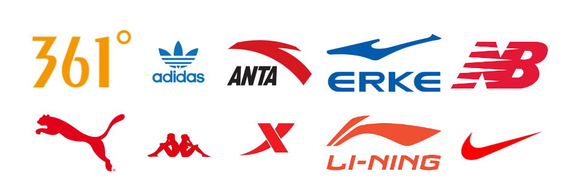
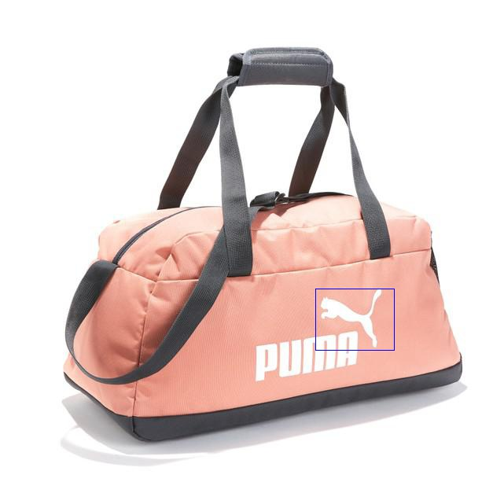
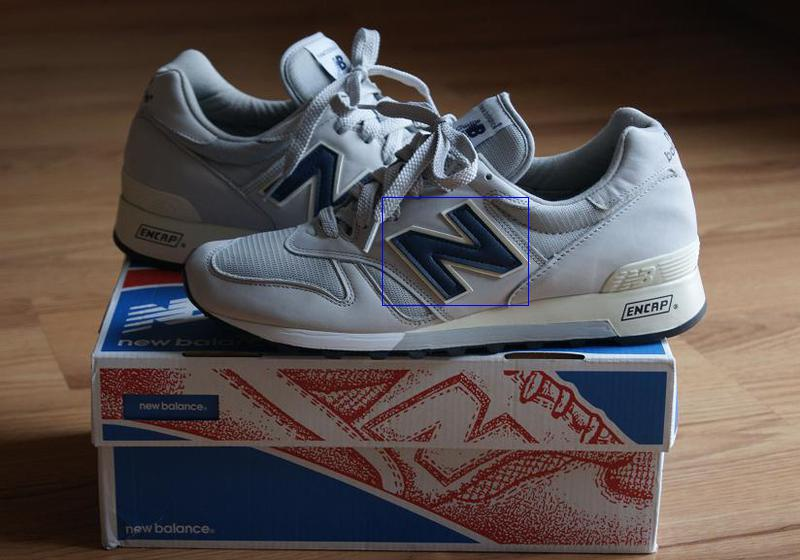
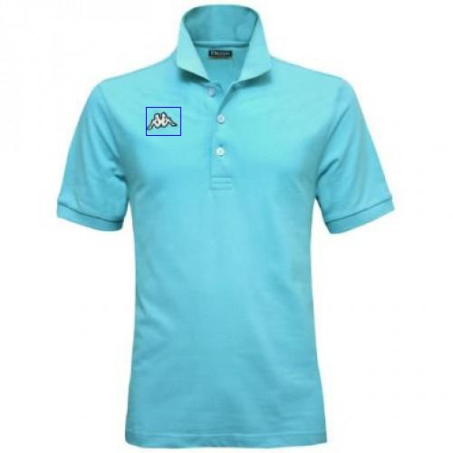
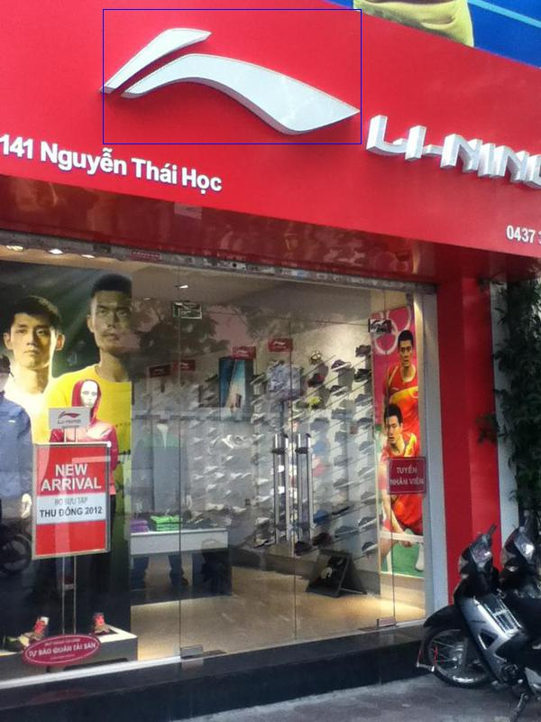

# FlickrSportLogos-10

### Introduction

This is a logo dataset called FlickrSportLogos-10, and it contains 10 sprot logos:361°, Adidas, ANTA, ERKE, KAPPA, Lining, NB, Nike, Puma, Xtep, just as follow picture.



We crawled data from `flickr.com`、`google.com` and `baidu.com`, most of pictures are from `flickr.com` and it contains 10 sport logos, so we call FlickrSportLogos-10.

FlickrSportLogos-10 contains 2038 images in total, the number of each type of logo is a follow table. We select 1538 for train and 500(50 test image per logo) for test.

|361°| Adidas| ANTA | ERKE | KAPPA| Lining| NB | Nike|Puma|Xtep| 
|----|-------|-------|-----|------|-------|----|-----|----|----|
|200 |  210  |  220  | 206 | 188  |  201  | 205| 205 | 198| 205| 

###  Image Examples

 







### Dir Structure

```
├── README.md
├── dataset
│   ├── Annotations #annotations of picture
│   ├── JPEGImages #all images
│   ├── test.txt #test image for dataset
│   └── train.txt # train image for dataset
└── readme_pic #the picture used in README.md
    └── ...
```

The Annotations are xml like VOC dataset, for `361_0_00001.xml`， just like follows:

```
<annotation>
    <folder>VOC2007</folder> # the image dir, you can direct change to voc dir
    <filename>361_0_00001.jpg</filename> #image name
    <size> # image size
        <width>800</width>
        <height>800</height>
        <depth>3</depth>
    </size>
    <segmented>0</segmented> # you can ignore
    <object>
        <name>361</name> # bbox class
        <pose>Unspecified</pose> # you can ignore
        <truncated>0</truncated> # you can ignore
        <difficult>0</difficult> # you can ignore
        <bndbox> #bbox location
            <xmin>381</xmin>
            <ymin>316</ymin>
            <xmax>443</xmax>
            <ymax>348</ymax>
        </bndbox>
    </object>
    <object>
        ......
    </object>
</annotation>

```

### Detection and Recognization Test

We used [Faster R-CNN](https://github.com/rbgirshick/py-faster-rcnn) and get the follow result.

|361°| Adidas| ANTA | ERKE | KAPPA| Lining| NB | Nike|Puma|Xtep| mAP
|----|-------|-------|-----|------|-------|----|-----|----|----| ---|
|0.808|0.813|0.902|0.806|0.703|0.763|0.904|0.620|0.774|0.712|0.780 


---
- If you hava any questions, you can contact me with email(zhangshuzhou.hi@163.com).


